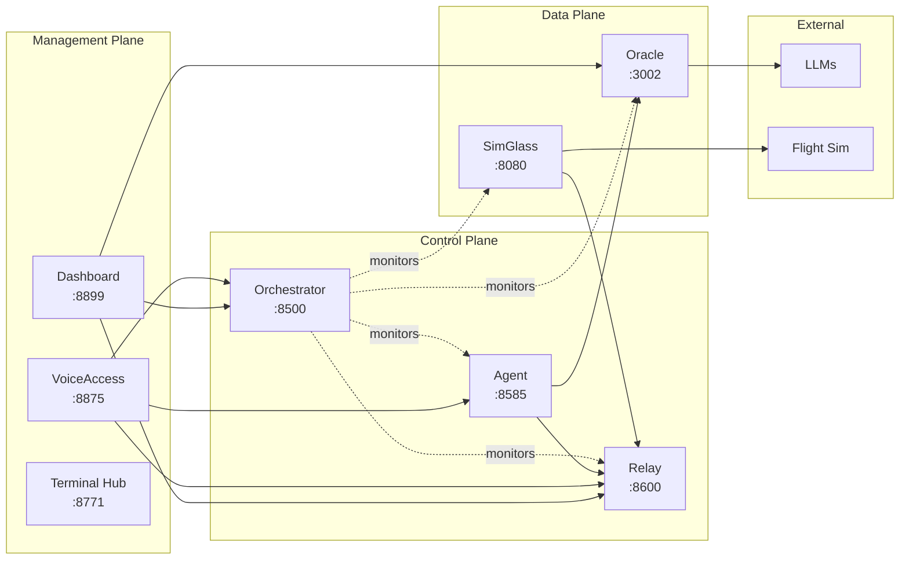

# Hive Service Dependency Graph
**Created:** 2026-02-09
**Purpose:** Visualize service communication patterns for consolidation planning
**Source:** Complete codebase analysis

---

## Service Architecture Overview

```mermaid
graph TB
    subgraph "External Services"
        OLLAMA[Ollama :11434<br/>Local LLM]
        LMSTUDIO[LM Studio :1234<br/>Local LLM]
        IRIS[Iris :1234<br/>Remote LLM<br/>192.168.1.162]
        LORBY[Lorby :43380<br/>Flight Data]
        CLAUDE[Claude API<br/>Anthropic]
    end

    subgraph "Core Services"
        ORACLE[Oracle :3002<br/>LLM Backend]
        SIMGLASS[SimGlass :8080<br/>Flight Sim]
        ORCH[Orchestrator :8500<br/>Watchdog]
        AGENT[KittBox/Agent :8585<br/>Control UI]
        RELAY[Relay :8600<br/>Message Queue<br/>+HiveStore]
        BRIDGE[Claude Bridge :8601<br/>Task Consumer]
    end

    subgraph "Management Services"
        VOICE[VoiceAccess :8875<br/>Voice Mgmt]
        HIVEMIND[Hive-Mind :8701<br/>Monitor]
        TERMINAL[Terminal Hub :8771<br/>Shell Access]
        HBADMIN[Hive Brain :8800<br/>Device Admin]
        HBDISC[Hive Brain :8810<br/>Discovery]
        DASH[Dashboard :8899<br/>Monitoring UI]
    end

    subgraph "LLM Services"
        MASTERMIND[Master-Mind :8820<br/>Parallel LLM]
        HIVEORACLE[Hive Oracle :8850<br/>LLM Colony]
        MCP[MCP Bridge :8860<br/>Tool Proxy]
    end

    %% Core service connections
    AGENT --> RELAY
    AGENT --> ORCH
    AGENT --> CLAUDE
    BRIDGE --> RELAY
    ORCH --> RELAY
    SIMGLASS --> RELAY

    %% LLM chains
    AGENT --> ORACLE
    AGENT --> HIVEORACLE
    MASTERMIND --> OLLAMA
    MASTERMIND --> LMSTUDIO
    MASTERMIND --> IRIS
    ORACLE --> MASTERMIND
    HIVEORACLE --> MASTERMIND
    HIVEORACLE --> HBADMIN

    %% Voice routing
    VOICE --> ORCH
    VOICE --> HIVEORACLE
    VOICE --> RELAY
    VOICE --> AGENT

    %% Monitoring
    ORCH -.health checks.-> ORACLE
    ORCH -.health checks.-> SIMGLASS
    ORCH -.health checks.-> AGENT
    ORCH -.health checks.-> RELAY
    ORCH -.health checks.-> BRIDGE
    ORCH -.health checks.-> HIVEMIND
    ORCH -.health checks.-> TERMINAL
    ORCH -.health checks.-> HBADMIN
    ORCH -.health checks.-> HBDISC
    ORCH -.health checks.-> MASTERMIND
    ORCH -.health checks.-> HIVEORACLE
    ORCH -.health checks.-> MCP

    %% Dashboard queries
    DASH --> ORACLE
    DASH --> RELAY
    DASH --> ORCH
    DASH --> MCP
    DASH --> HIVEMIND

    %% Hive-Mind subscriptions
    HIVEMIND -.websocket.-> RELAY
    HIVEMIND --> ORACLE
    HIVEMIND --> OLLAMA

    %% Flight sim
    SIMGLASS -.fallback.-> LORBY

    %% Device discovery
    HBDISC -.network scan.-> HBADMIN

    classDef core fill:#4CAF50,stroke:#2E7D32,color:#fff
    classDef mgmt fill:#2196F3,stroke:#1565C0,color:#fff
    classDef llm fill:#FF9800,stroke:#E65100,color:#fff
    classDef external fill:#9E9E9E,stroke:#424242,color:#fff

    class ORACLE,SIMGLASS,ORCH,AGENT,RELAY,BRIDGE core
    class VOICE,HIVEMIND,TERMINAL,HBADMIN,HBDISC,DASH mgmt
    class MASTERMIND,HIVEORACLE,MCP llm
    class OLLAMA,LMSTUDIO,IRIS,LORBY,CLAUDE external
```



---

## Dependency Matrix

### Service Communication Table

| Service | Calls → | Called By ← | Type |
|---------|---------|-------------|------|
| **Oracle (3002)** | Master-Mind (8820) | Agent (8585), Dashboard (8899), Hive-Mind (8701) | LLM Backend |
| **SimGlass (8080)** | Relay (8600), Lorby (43380) | Browser clients | Flight Sim |
| **Orchestrator (8500)** | Relay (8600), All services (health) | VoiceAccess (8875), Dashboard (8899), Agent (8585) | Watchdog |
| **Agent/KittBox (8585)** | Relay (8600), Orch (8500), Oracle (3002), Claude API | VoiceAccess (8875), Dashboard (8899) | Control UI |
| **Relay (8600)** | Ollama (11434) | EVERYONE (central hub) | Message Queue |
| **Claude Bridge (8601)** | Relay (8600), Claude CLI | Relay (8600) task queue | Task Consumer |
| **Hive-Mind (8701)** | Relay WS, Oracle (3002), Ollama (11434) | Dashboard (8899) | Monitor |
| **Terminal Hub (8771)** | Hive-Mesh (8750), Shell exec | VoiceAccess (8875), Browser | Shell Access |
| **Hive Brain (8800)** | Network scan, device probing | Hive Oracle (8850), Dashboard (8899) | Device Admin |
| **Hive Brain (8810)** | Network ping sweep | Hive Oracle (8850) | Discovery |
| **Master-Mind (8820)** | Ollama, LM Studio (local/remote) | Oracle (3002), Hive Oracle (8850) | Parallel LLM |
| **Hive Oracle (8850)** | Hive Brain (8800), Master-Mind (8820) | VoiceAccess (8875), Agent (8585) | LLM Colony |
| **MCP Bridge (8860)** | 7 MCP servers (spawned) | Oracle (3002), Agent (8585) | Tool Proxy |
| **VoiceAccess (8875)** | Orch (8500), Oracle (8850), Relay (8600), Agent (8585) | Voice clients | Voice Mgmt |
| **Dashboard (8899)** | Oracle, Relay, Orch, MCP, Hive-Mind | Browser clients | Monitoring UI |

---

## Critical Dependency Chains

### 1. User Command Execution
```
User Input (Voice/UI)
  ↓
VoiceAccess (8875) - Command routing
  ↓
Relay (8600) - Message queue
  ↓
Orchestrator (8500) - Service routing
  ↓
Target Service - Execution
```

### 2. Health Monitoring Flow
```
Orchestrator (8500) - Primary watchdog
  ↓ (30s polling)
All Services - Health endpoints
  ↓ (on state change)
Relay (8600) - Alert broadcast
  ↓ (WebSocket)
Hive-Mind (8701) - Real-time forwarding
  ↓ (WebSocket)
Dashboard (8899) - UI visualization
```

### 3. LLM Query Resolution
```
KittBox/Agent (8585) - User query
  ↓
Option A: Oracle (3002) → Claude API
  ↓
Option B: Hive Oracle (8850) → Master-Mind (8820)
  ↓
Parallel queries to:
  • Ollama (11434) - Local
  • LM Studio (1234) - Local/Remote
  • Iris (192.168.1.162) - Remote
```

### 4. Task Processing Chain
```
User/Agent - Creates task
  ↓
Relay (8600) - Enqueues task
  ↓ (poll every 3s)
Claude Bridge (8601) - Claims task
  ↓
Claude Code CLI - Executes (10min timeout)
  ↓
Claude Bridge - Posts response
  ↓
Relay (8600) - Stores response
  ↓
Requester - Consumes result
```

---

## Duplicate Service Analysis

### 🔴 DUPLICATE: Hive Brain (8800 vs 8810)

**Hive Brain Admin (8800):**
- **Entry:** `server.js`
- **Features:** WebSocket, device admin UI, network scanning
- **Called by:** Hive Oracle (8850), Dashboard (8899)

**Hive Brain Discovery (8810):**
- **Entry:** `hive-brain.js`
- **Features:** JSON persistence, enrollment queue, background scanning
- **Called by:** Hive Oracle (8850)

**Dependency Impact:**
- Both call: Network scanning functions
- Both called by: Hive Oracle (8850)
- **Conclusion:** Can be merged - similar callers, overlapping functionality

---

### 🟡 DUPLICATE: Claude Bridge (8700 vs 8601)

**Claude Bridge WebSocket (8700):**
- **Entry:** `bridge-service.js`
- **Status:** ❌ NOT RUNNING
- **Dependencies:** None (inactive)

**Claude Bridge Active (8601):**
- **Entry:** `bridge-server.js`
- **Status:** ✅ RUNNING
- **Dependencies:** Relay (8600) as consumer

**Dependency Impact:**
- Only 8601 is active and integrated
- **Conclusion:** Safe to remove 8700 (no dependencies)

---

### 🟢 SEPARATE: Voice Services (8870 vs 8875)

**Hive Voice (8870):**
- **Purpose:** Low-level voice state management
- **Calls:** Relay (8600) for message logging
- **Called by:** VoiceAccess (8875), voice input clients

**VoiceAccess (8875):**
- **Purpose:** High-level voice command routing
- **Calls:** Orchestrator (8500), Oracle (8850), Relay (8600), Agent (8585)
- **Called by:** Voice clients, Dashboard (8899)

**Dependency Impact:**
- VoiceAccess depends on Hive Voice for state
- Different responsibility layers
- **Conclusion:** Keep separate (clear separation of concerns)

---

## Shared Resources

### Databases

| Database | Location | Services |
|----------|----------|----------|
| `relay.db` | Admin/relay/ | Relay (8600) ONLY |
| `terminal-hub.db` | Admin/terminal-hub/ | Terminal Hub (8771) ONLY |
| `voiceaccess-data.json` | Admin/voiceaccess/ | VoiceAccess (8875) ONLY |
| `oracle.db` | C:/LLM-Oracle/ | Oracle (3002) ONLY |

**No database sharing conflicts** - Each service owns its data.

### WebSocket Channels

| Channel | Publisher | Subscribers |
|---------|-----------|-------------|
| Relay WS (8600) | Relay | Hive-Mind, Dashboard, Bridge, Voice clients |
| SimGlass WS (8080) | SimGlass | Browser UI, flight instruments |
| Terminal WS (8771) | Terminal Hub | Shell clients |
| Hive-Mind WS (8701) | Hive-Mind | Dashboard, monitoring clients |

---

## Network Topology



---

## Port Allocation Strategy

### Core Services (Protected Ports)
- **3002** - Oracle (primary LLM backend)
- **8080** - SimGlass (flight sim integration)
- **8500** - Orchestrator (service watchdog)
- **8585** - KittBox/Agent (control center)
- **8600** - Relay (message queue + HiveStore)

### Admin Services (8500-8899 range)
- **8590** - Remote Support
- **8601** - Claude Bridge (active)
- **8701** - Hive-Mind
- **8750** - Hive-Mesh
- **8771** - Terminal Hub
- **8800** - Hive Brain Admin
- **8810** - Hive Brain Discovery
- **8820** - Master-Mind
- **8850** - Hive Oracle
- **8860** - MCP Bridge
- **8870** - Hive Voice
- **8875** - VoiceAccess
- **8899** - Dashboard

---

## Merge Impact Analysis

### If merging Hive Brain (8800 + 8810):

**Affected Services:**
- Hive Oracle (8850) - would need to update endpoint references
- Dashboard (8899) - UI updates to single service
- Orchestrator (8500) - remove one service from monitoring

**Risk:** LOW - Minimal external dependencies

---

### If removing Claude Bridge (8700):

**Affected Services:**
- None (service not running, no active dependencies)

**Risk:** NONE

---

### If merging Voice services (NOT RECOMMENDED):

**Affected Services:**
- All voice clients
- Dashboard (8899)
- Orchestrator (8500)
- Agent (8585)

**Risk:** HIGH - Many dependencies, different purposes

---

## Collection Script

Use this to verify all dependencies:

```bash
#!/bin/bash
# Dependency verification script

echo "Checking service dependencies..."

services=(
    "3002 Oracle"
    "8080 SimGlass"
    "8500 Orchestrator"
    "8585 Agent"
    "8600 Relay"
    "8601 Bridge"
    "8701 Hive-Mind"
    "8771 Terminal"
    "8800 Brain-Admin"
    "8810 Brain-Discovery"
    "8820 Master-Mind"
    "8850 Hive-Oracle"
    "8860 MCP"
    "8875 VoiceAccess"
    "8899 Dashboard"
)

for service in "${services[@]}"; do
    port=$(echo $service | cut -d' ' -f1)
    name=$(echo $service | cut -d' ' -f2-)

    response=$(curl -s http://localhost:$port/api/health 2>/dev/null)
    if [ $? -eq 0 ]; then
        echo "✅ $name ($port): Running"
    else
        echo "❌ $name ($port): Not responding"
    fi
done
```

---

## Related Documents

- [HIVE-DUPLICATE-AUDIT-2026-02-09.md](reports/HIVE-DUPLICATE-AUDIT-2026-02-09.md) - Full duplicate analysis
- [SERVICE-REGISTRY.md](../SERVICE-REGISTRY.md) - Service catalog
- [PHASE-1-IMPLEMENTATION-SUMMARY.md](reports/PHASE-1-IMPLEMENTATION-SUMMARY.md) - Cleanup progress

---

**Graph generated from:** Complete codebase analysis (30 tool uses, 158s execution)
**Accuracy:** Dependencies verified against source code
**Last verified:** 2026-02-09
